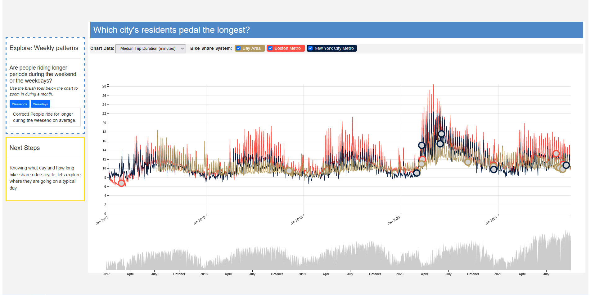

# bikedata

### CS171 Final Project
* No-no Groenen
* Gordon Hew
* Richard Morello
* Patrick Watts

### Links

Live implementation on Github pages: 
https://hewness.github.io/bikeshare/

**Bikedata** is a tool for visualizing and comparing three public bike-share systems in the United States: 
BayWheels, covering San Francisco, BlueBikes, covering the Boston Metro area and CitiBike, covering the New 
York City metro area.   

The original publicly available data contains a row of text for every ride and the files are stored as CSV files 
with one file per month of data.  Our team focused on data from January 2017 through September 2021.  The data were 
downloaded and loaded in to a large Apache Parquet data source which can be queried using Spark. 

### Project Media
* Website: https://hewness.github.io/bikeshare/
* Video: https://www.youtube.com/watch?v=dWJkf18BCMM

### Public Datasets
* San Francisco Bay Wheels System Data, https://www.lyft.com/bikes/bay-wheels/system-data
* Boston Blue Bikes System Data, https://www.bluebikes.com/system-data
* New York City bike share data, https://ride.citibikenyc.com/system-data

The data for the website contain extracts and summaries of the larger data source and are checked into this 
repository as CSV files.   

### Project layout

The project consists of the Spark data processing component which is in the `process_data` folder.

The web visualization component, including the summary data, is in the `web` folder.

The `web` **folder** contains the following:
* `css` **folder**
  * _leaflet.css_  &emsp;This is for the leaflet library used for the map.
  * _style.css_  &emsp;The CSS by us, which applies to the whole project.
* `data` **folder** &emsp; This folder contains csv files with data that is preprocessed for our graphs.
* `fonts` **folder**&emsp;Here are fonts and icons from https://www.glyphicons.com
* `images`**folder**
  * _Our portrait pictures_ 
  * _BlueBikes-Carousel.jpg_&emsp;Source: Harvard Campus Services
  * _bay_wheels_logo.png_ &emsp;https://help.baywheels.com/hc/en-us
  * _citi_bike_logo.svg_&emsp;https://duckduckgo.com/?t=ffab&q=citybikes&ia=web
  * _rainbow_blue_bikes.jpg_&emsp;  Photo by Richard Morello
* `js` **folder**
  * _barVis.js_ &emsp;Barchart for cummalative trip count
  * _dayViewRadial.js_&emsp;Radial chart to see the amount of trips per time, by Pattrick Watts.
  * _forceNetworkVis.js_&emsp;  Networkgraph gives most popular routes, by Gordon Hew
  * _leaflet.js_ &emsp;Library for maps.
  * _leaflet.js_map&emsp;Library
  * _lineGraphVis.js_&emsp;Used to plot the amount of round trips
  * _main.js_&emsp;Used by all
  * _scroller.js_&emsp;Used to implement scrolly-telling style website, used by Richard Morello
  * _stackedAreaVis.js_&emsp;Used to plot the count of stations over time, Richard Morello
  * _timeSeriesPlotVis.js_ &emsp; Gordon Hew
  * _timeSeriesTimeline.js_&emsp; Gordon Hew
  * _timeSeriesVis.js_&emsp; Gordon Hew
  * _windMap.js_ &emsp;UThe directional map. Code by No-no Groenen
* _index.html_ &emsp;Scrollytelling implementation by Richard Morello

### Features of our website

**Navigation**
- While scrolling down the page you will be guided through the story.
- By fading the pages into each other the transition is smooth.
- Next to the blue boxes at the left side there are yellow ones that guide you to the next slide.
- As you scroll down you will see different versions of the same graph, but with a different context.
- The boxes with the dashed lines have small questions to engage you in the story.
  
- The stacked areachart "stations by city" has a vertical guide and tooltip. 

**Linecharts**
- "How does ridership compare accross cities over time" these charts have a brushable horizontal chart area.
- The linechart also has notes of relevant news articles that might have influenced ridership, these are marked as circles.
- You can select the kind of data and the city you prefer.
- The linechart also has a vertical ruler and tooltip.

**Direction map**
- The direction map consist mostly out of red and green circles. To express a net movement
only the amount that is larger is taken into account. Say a station has 6 coming and 8 leaving,
Then that is regarded a station with a net outward direction and will be red. While hovering or clicking the station 
it will show the 8 connected stations. Golden stations have the same net amount of incoming 
and outgoing people. And will show all connections.
- The circles are scaled for people by area, square root. The lines by thickness.
- If there would be only round-trips from the station then it would be blue, these are rare
as there is also other people using these stations. They don't represent a net movement.
  
- While hovering a dotted line in green or red will represent people on the move at that time.
The thickness of the line relates to the amount of travellers on that route. If the line
is red, then there are more people leaving that station at that moment.- 
- If you click a station it becomes pink, you can select multiple stations. In the latests implementation
all routes will stay on the map for the selected stations. You will be able to track further
as a single connections. Or you can identify hubs, where people want to go.

- You can select the time, you will be able to see the difference of movement between the city 
and the suburbs. One will color red in the morning the other in the afternoon because of
work travel.- 
- The legend is dynamic, it will show the scale as it is represented. If you zoom in or out
the legend will follow that scale. If it becomes too big it will close, but you can bring it
back by clicking "show". Or hide it by clicking on the legend.
- The grey stations are inactive, but you can still click them. You will see the name of the 
station in the tooltip. Click on the tooltip to unselect all stations. Click a single station again
to unselect just that one.
- You can pan over the map, you will find other place with bikeshares like north of Boston,
in Salem or South of San Fransisco.

**Forcemap**

- The map that shows the most popular routes is a force map. You can select the number the top consists 
of and it will generate a map based on popularity instead of geospatial properties.
You can drag the stations around. If you select a high number the names might be overlapping, but by dragging
them, you can pull them in a better position.
- Selecting a different area will make the graph jump in place as well.

**Radialchart**

- This chart represents the amount of trips in a city by minute. 
- You can select and unselect days to add them to the charts. You will find patterns that are sometimes shared 
by the cities or stand out.
- The color of the selected day in the calendar is represented by a line with the same color.
- The clock represents 24 hours, with midnight on top.

### Technologies Used

* Apache Spark, https://spark.apache.org/
* Data Driven Documents (D3 version 7), https://d3js.org/
* Apache Parquet, https://parquet.apache.org/
* Leaflet JS, for the map, https://leafletjs.com/

### Screencast video

https://youtu.be/dWJkf18BCMM

### Project Website

https://hewness.github.io/bikeshare/
